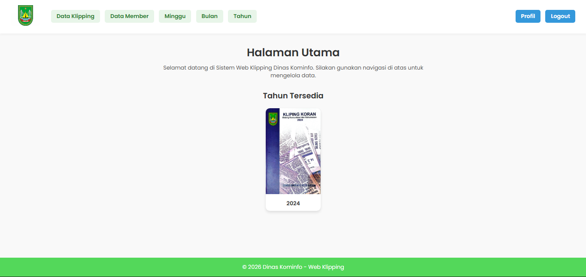

<div align="center">
  
</div>

# Website Klipping Koran Diskominfo Batam

# 📰 Website Klipping Koran Diskominfo Kota Batam

## 📌 Deskripsi

Website **Klipping Koran Diskominfo Kota Batam** adalah sebuah platform berbasis web yang digunakan untuk mengelola, menyimpan, dan menampilkan klipping berita dari berbagai media cetak maupun digital yang berkaitan dengan Pemerintah Kota Batam. Website ini bertujuan untuk mempermudah dokumentasi informasi publik serta monitoring pemberitaan secara terstruktur dan terarsip dengan baik.

Website ini dirancang dengan tampilan sederhana, informatif, dan mudah digunakan, sehingga dapat diakses oleh admin maupun pengguna internal dengan efisien.

---

## 🎯 Tujuan

* Mendokumentasikan berita dan informasi terkait Kota Batam
* Mempermudah proses pengarsipan klipping koran
* Menyediakan akses cepat terhadap berita berdasarkan tanggal dan kategori
* Mendukung transparansi dan dokumentasi informasi publik

---

## ✨ Fitur Utama

* 📂 Manajemen klipping koran (tambah, lihat, hapus)
* 🗓️ Pengelompokan berita berdasarkan tanggal
* 📰 Kategori media dan topik berita
* 🔍 Pencarian klipping koran
* 📄 Upload file (PDF / gambar hasil scan koran)
* 🔐 Halaman admin (opsional)

---

## 🛠️ Teknologi yang Digunakan

> **Catatan Path Repository**
> Repository: [https://github.com/Rivetchan/Web-Klipping-Koran](https://github.com/Rivetchan/Web-Klipping-Koran)
> Struktur path disesuaikan dengan folder utama project ini.

* **Frontend**: HTML, CSS, JavaScript
* **Backend**: PHP
* **Database**: MySQL / MariaDB
* **Server**: Apache (XAMPP)
* **Tools Pendukung**: VS Code

---

## 📁 Struktur Folder

```text
Web-Klipping-Koran/
├── assets/
│   ├── css/
│   │   └── style.css
│   ├── images/
│   │   └── preview-web.png
│   └── js/
│       └── script.js
├── data/
│   └── berita.json
├── index.html
└── README.md
```

/klipping-koran
│── index.php
│── admin/
│── assets/
│   ├── css/
│   ├── js/
│   └── images/
│── uploads/
│── config/
│── database/
└── README.md

```

---

## 🚀 Cara Menjalankan Website
1. Install **XAMPP**
2. Jalankan **Apache** dan **MySQL**
3. Pindahkan folder project ke:
```

C:/xampp/htdocs/

```
4. Import database ke phpMyAdmin
5. Akses melalui browser:
```

[http://localhost/klipping-koran](http://localhost/klipping-koran)

```

---

## 📸 Tampilan Website
> (Tambahkan screenshot website di sini)

---

## 🧑‍💻 Pengembang
Website ini dikembangkan sebagai bagian dari proyek **Klipping Koran Diskominfo Kota Batam**, dengan fokus pada pengelolaan informasi dan dokumentasi berita.

---

## 📄 Lisensi
Proyek ini digunakan untuk keperluan dokumentasi dan internal Diskominfo Kota Batam.

---

💡 *Website ini diharapkan dapat membantu Diskominfo Kota Batam dalam mengelola informasi publik secara lebih efektif dan terstruktur.*

```
